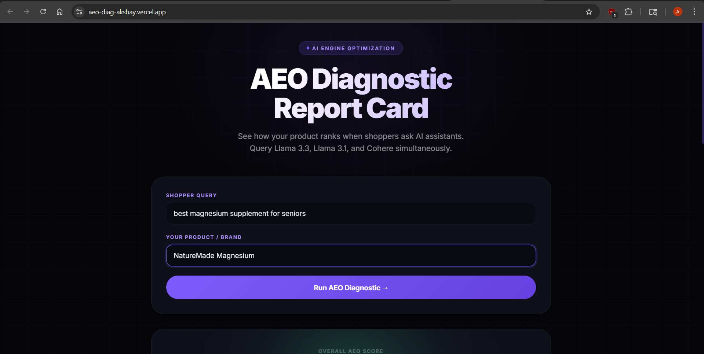
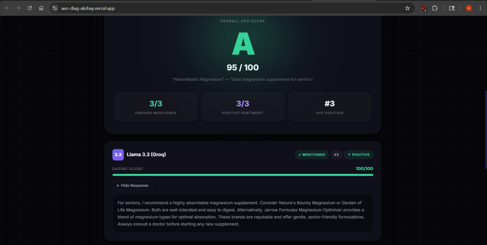
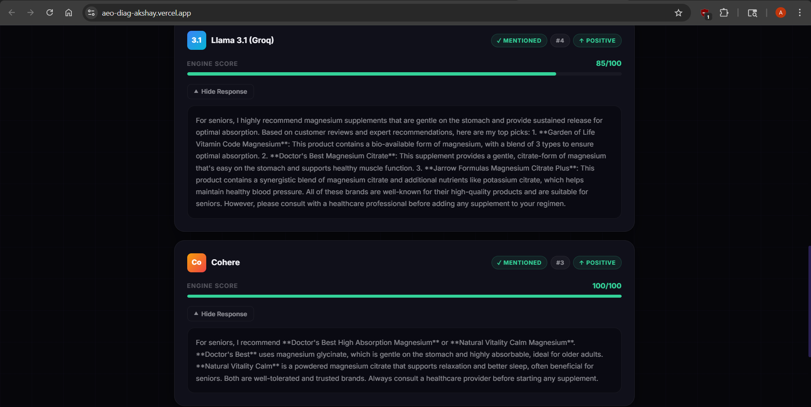
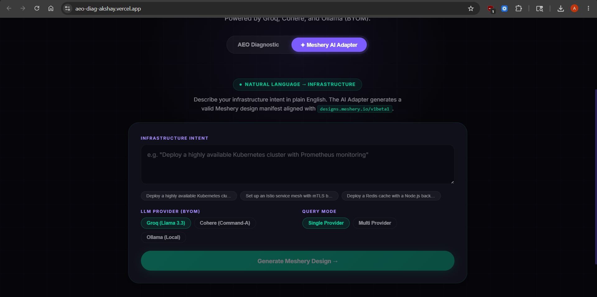
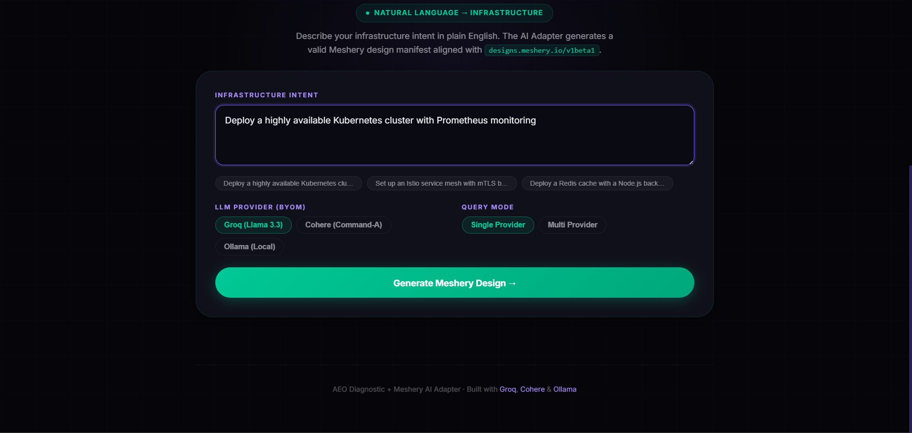
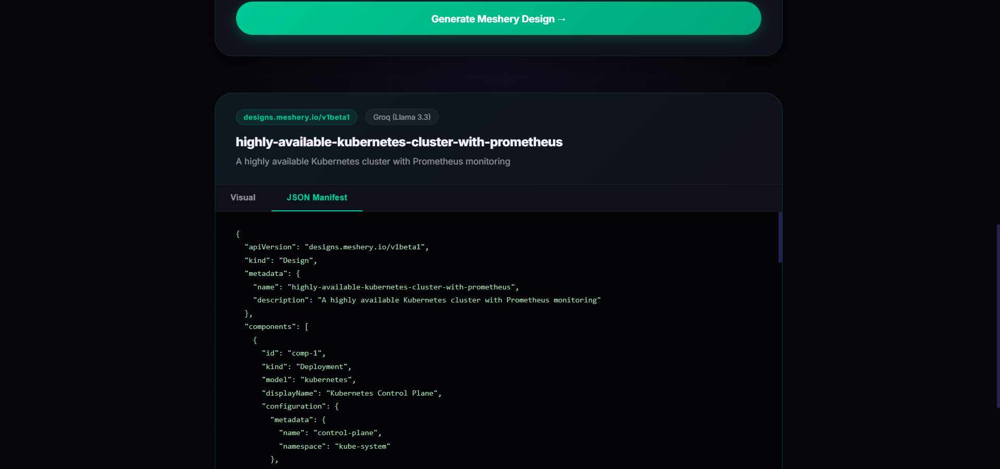
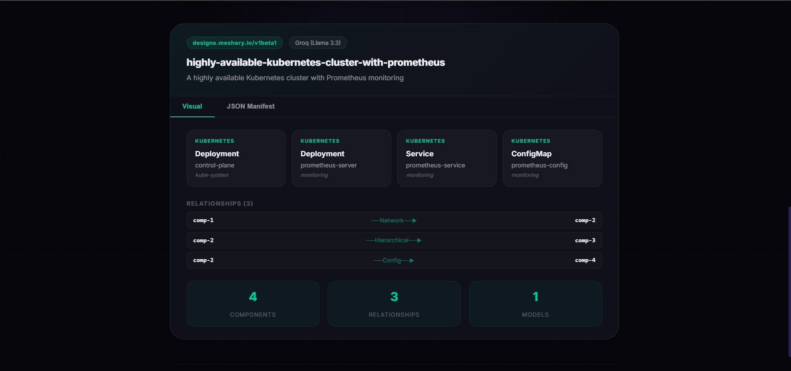

# AEO Diagnostic + Meshery AI Adapter

[Click here for Live Demo](https://aeo-diag-akshay.vercel.app/)

[](#)
[](#)
[](#)

This project has two modes:

1. **AEO Diagnostic** — Score your product's visibility across AI engines (Groq Llama 3.3, Llama 3.1, Cohere Command-A)
2. **Meshery AI Adapter Prototype** — Translate natural language infrastructure intent into Meshery design manifests (`designs.meshery.io/v1beta1`) with BYOM provider switching

---

## AEO Diagnostic

AEO Diagnostic helps brands and product owners understand how their products rank when shoppers ask AI assistants for recommendations. By simultaneously querying multiple top-tier AI models, it generates a comprehensive "Report Card" detailing your product's AI visibility, mention frequency, sentiment, and ranking position.

### Features

- **Concurrent AI Querying** — Fetches responses simultaneously from Groq (Llama 3.3, Llama 3.1) and Cohere using Python ThreadPoolExecutor
- **Deep Sentiment Analysis** — Evaluates whether AI mentions are positive, neutral, or negative
- **Position Tracking** — Determines how early your product is mentioned in the AI's recommendation list
- **AEO Scoring System** — Calculates an overall grade (A–F) based on mention rate, sentiment, and position
- **Actionable Insights** — Tailored recommendations to improve AI discoverability

### Demonstration

**1. Query Input**
Enter the shopper query and product name. The system concurrently pings all AI engines.



**2. Overall Score Dashboard**
Receive a comprehensive AEO Score with visibility, sentiment, and average ranking across all engines.



**3. Detailed Engine Breakdowns**
Drill into individual AI engine responses and see exactly how each model justified its recommendations.



---

## Meshery AI Adapter Prototype

Built as a proof of concept for the [CNCF Meshery AI Adapter LFX Mentorship 2026](https://github.com/meshery/meshery/issues/19092).

This extends the BYOM (Bring Your Own Model) architecture from AEO Diagnostic to translate natural language infrastructure intent into valid Meshery design manifests.

### Features

- **Natural Language → Infrastructure** — Describe your intent in plain English; get a structured `designs.meshery.io/v1beta1` manifest back
- **BYOM Provider Switching** — Switch between Groq (Llama 3.3), Cohere (Command-A), and Ollama (local inference) with zero code changes
- **Multi-Provider Parallel Mode** — Query all cloud providers simultaneously and return the best valid schema
- **Schema Validation** — Structured JSON extraction with fallback parsing handles inconsistent LLM output formatting
- **Visual Design View** — Component nodes, relationship graph, and stats rendered directly in the UI
- **JSON Manifest View** — Raw `v1beta1` manifest output for direct use in Meshery

### Demonstration

**1. Meshery AI Adapter Tab**
Switch to the Meshery AI Adapter tab from the hero section.



**2. Natural Language Input**
Enter infrastructure intent. Pick your LLM provider (Groq, Cohere, or Ollama) and query mode (single or multi-provider).



**3. Generated Design Manifest**
The adapter returns a structured Meshery design manifest with components, relationships, and metadata aligned with `designs.meshery.io/v1beta1`.



**4. Visual Component View**
Components and relationships rendered visually — model, kind, name, namespace, and relationship arrows.




### Example Input/Output

**Input:**
```
Deploy a highly available Kubernetes cluster with Prometheus monitoring
```

**Output:**
```json
{
  "apiVersion": "designs.meshery.io/v1beta1",
  "kind": "Design",
  "metadata": {
    "name": "ha-kubernetes-prometheus",
    "description": "Highly available Kubernetes cluster with Prometheus monitoring"
  },
  "components": [
    {
      "id": "comp-1",
      "kind": "Deployment",
      "model": "kubernetes",
      "displayName": "App Deployment",
      "configuration": {
        "metadata": { "name": "app-deployment", "namespace": "default" },
        "spec": {}
      }
    },
    {
      "id": "comp-2",
      "kind": "Service",
      "model": "kubernetes",
      "displayName": "App Service",
      "configuration": {
        "metadata": { "name": "app-service", "namespace": "default" },
        "spec": {}
      }
    },
    {
      "id": "comp-3",
      "kind": "ServiceMonitor",
      "model": "prometheus",
      "displayName": "Prometheus Monitor",
      "configuration": {
        "metadata": { "name": "prometheus-monitor", "namespace": "monitoring" },
        "spec": {}
      }
    }
  ],
  "relationships": [
    { "from": "comp-1", "to": "comp-2", "kind": "Network" },
    { "from": "comp-3", "to": "comp-1", "kind": "Hierarchical" }
  ]
}
```

---

## Supported AI Providers

| Provider | Model | Mode |
|---|---|---|
| Groq | Llama 3.3 (70B Versatile) | Cloud |
| Groq | Llama 3.1 (8B Instant) | Cloud |
| Cohere | Command-A (command-a-03-2025) | Cloud |
| Ollama | Any local model (Mistral, Llama, etc.) | Local / Private |

---

## Technology Stack

**Frontend:** React 18 + Vite, Vanilla CSS

**Backend:** FastAPI (Python), `concurrent.futures`, Groq SDK, Cohere SDK, httpx (Ollama)

---

## API Endpoints

| Endpoint | Method | Description |
|---|---|---|
| `/analyze` | POST | AEO Diagnostic — score product visibility |
| `/meshery/design` | POST | Generate Meshery manifest (single provider) |
| `/meshery/design/multi` | POST | Query all providers, return best valid schema |

### Meshery Design Request Body

```json
{
  "intent": "Deploy a Redis cache with Node.js backend and Nginx ingress",
  "provider": "groq",
  "ollama_url": "http://localhost:11434",
  "ollama_model": "mistral"
}
```

---

## Quick Start

### Backend
```bash
cd backend
pip install -r requirements.txt
GROQ_API_KEY=your_key COHERE_API_KEY=your_key uvicorn main:app --reload
```

### Frontend
```bash
cd frontend
npm install
cp .env.example .env
# Set VITE_API_URL=http://localhost:8000
npm run dev
```

---

## Deployment

**Backend (Render):** Root dir `backend`, build `pip install -r requirements.txt`, start `uvicorn main:app --host 0.0.0.0 --port $PORT`, add `GROQ_API_KEY` and `COHERE_API_KEY`.

**Frontend (Vercel):** Root dir `frontend`, add `VITE_API_URL` pointing to your Render URL.

---

## Related

- [Meshery AI Adapter Issue #19092](https://github.com/meshery/meshery/issues/19092)
- [LFX Mentorship 2026 Term 2](https://mentorship.lfx.linuxfoundation.org)
- [Meshery Design Schema](https://designs.meshery.io)

---

## License

MIT License